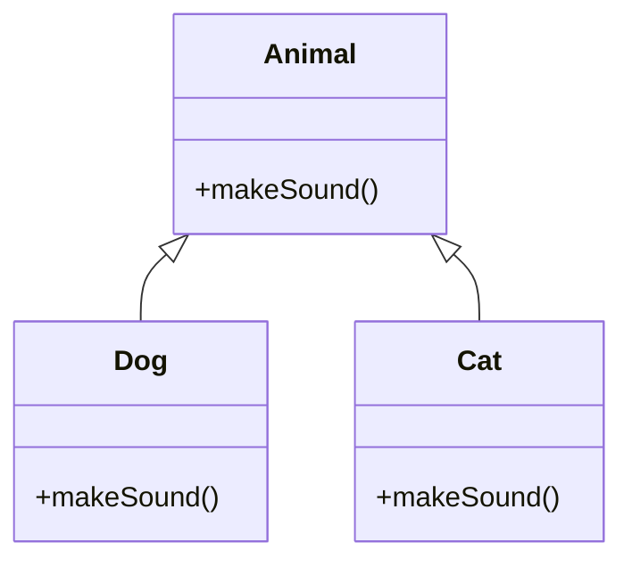
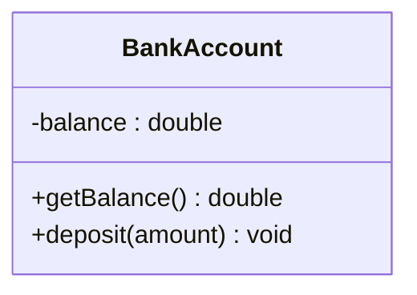

<h1 align="center"> 🚀 Java Data Structures Lab – Java Refresher Module</h1>


This repository contains all lecture materials and code examples used in the Java Refresher session for the Data Structures Lab.
The purpose of this module is to ensure that students have a solid and practical foundation in Java before moving into advanced Data Structures topics such as Linked Lists, Stacks, Queues, Trees, and Recursion.

This module is concise, example-driven, and focuses only on features directly required for the course.

---

## 📌 What You Will Learn

This refresher provides a structured review of the Java concepts most relevant to implementing data structures:

### 1. Java Basics

- Variables, data types, operators
- Control structures: if-else, loops, switch
- Input/output, method creation, static vs instance methods

### 2. Arrays & Strings

- 1D and 2D arrays
- Common array operations
- String immutability, basic manipulation
- Understanding memory behavior for arrays (important for DS)

### 3. Classes & Objects

- Class structure
- Constructors
- Attributes & methods
- Access modifiers (public, private, protected)

### 4. OOP Principles

- Encapsulation
- Inheritance
- Polymorphism (method overriding & dynamic dispatch)

### 5. Interfaces

- Interface creation and implementation
- Why interfaces matter in data structures (e.g., Comparable, Iterable)

### 6. Generics

- Generic classes (e.g., Node<T>, Pair<T, U>)
- Generic methods
- Type safety and compile-time checking

### 7. Exceptions

- try–catch
- checked vs unchecked exceptions
- custom exceptions
- error handling in DS implementations

> All examples are short, focused, and tied directly to concepts used later in Data Structures.

--- 

## 📁 Repository Structure

```bash
java-ds-lab-refresher/
│
├── basics/
│   └── BasicsDemo.java
│
├── arrays-strings/
│   └── ArrayStringDemo.java
│
├── oop/
│   ├── Student.java
│   ├── Shape.java
│   ├── Circle.java
│   ├── Square.java
│   └── PrintableDemo.java
│
├── generics/
│   ├── Pair.java
│   └── GenericMethods.java
│
└── exceptions/
    └── ExceptionDemo.java
```

> Each folder contains clean, minimal code examples aligned with topics covered in the refresher session.

---

### 🎯 Learning Goals

By the end of this module, students should be able to:

- Understand how Java stores and manages data
- Write and use classes that represent simple data structures
- Work with generics and create typed structures (e.g., Node<T>)
- Read and write code that uses interfaces
- Trace execution for array operations
- Use exceptions properly in Java programs
- Study and prepare for pointer-based structures such as linked lists

This refresher ensures a smooth transition into the core Data Structures Lab.

---

## 🎯 Mermaid UML Diagrams (OOP)

### Class Relationship Example



### Encapsulation Example



---

## 💻 How to Use

1. Clone the repository:

```bash
git clone https://github.com/Maryam-Skaik/java-ds-lab-refresher.git
```

2. Open the project in your favorite IDE (Eclipse, IntelliJ, VS Code).
3. Run the examples to study concepts.
4. Use the templates to implement your own exercises and experiments.

---

## ▶ Video: Java Refresher for Data Structures Lab

This repository corresponds to the recorded refresher lecture.

[Java Revision for Data Structures – Fast Complete Refresher](https://www.youtube.com/watch?v=Bp8oXAWWWjg)

---

## 🤝 Contribution

Improvements and additions to this refresher module are welcome.
Students and TAs may add:

- More examples
- Additional explanations
- Clarifications for beginners

---

## 📝 License

This code is free to use for educational purposes.
